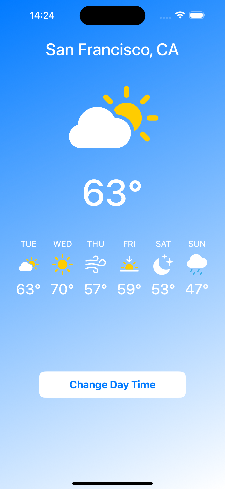

# 🌦️ Weather App (SwiftUI)

A simple weather app built with **SwiftUI**.  
The app displays the current weather for **San Francisco, CA**, and allows the user to toggle between **Day Mode** and **Night Mode** with a single tap.

---

## ✨ Features
- 📍 Static location: San Francisco, CA  
- 🌞 Day mode & 🌙 Night mode toggle  
- 📊 5-day forecast with icons and temperatures  
- 🎨 Clean and minimal SwiftUI design  

---

## 📸 Screenshots

| Day Mode | Night Mode |
|----------|------------|
|  |  |

---

## 🛠️ Tech Stack
- Swift  
- SwiftUI  

---

## 🎓 Learning Outcomes

While building this basic project, I learned:
- How to structure a basic SwiftUI project  
- Using **Stacks (HStack, VStack, ZStack)** for layout  
- Applying conditional rendering (Day Mode vs. Night Mode)  
- Styling views with gradients, colors, and system icons  
- Handling user interactions with **@State**  
- Creating a clean and minimal UI with SwiftUI components  
